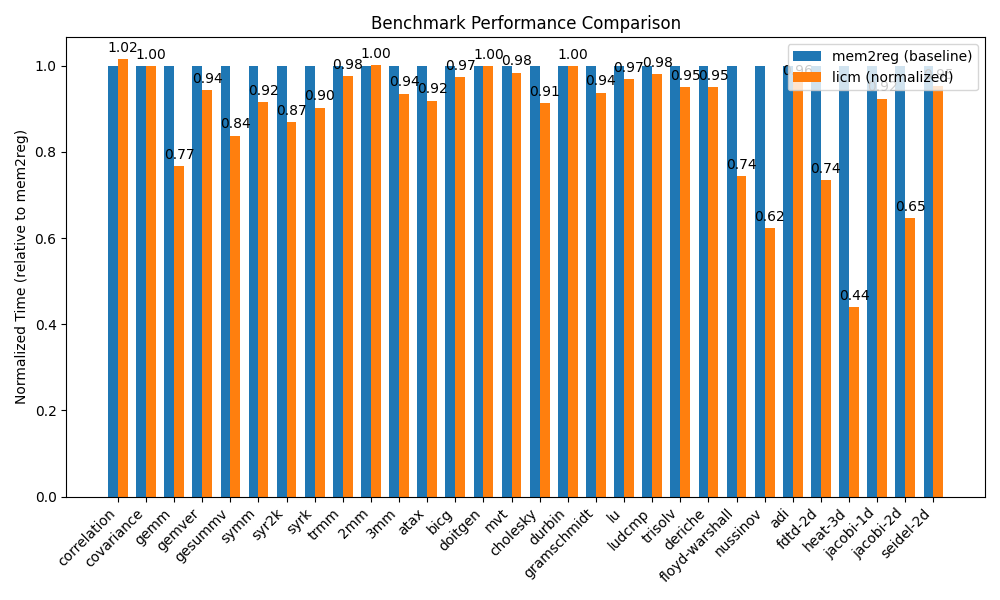

### [Pass](https://github.com/neel-patel-1/GettingStartedWithBril/tree/main/lesson8)
For this assignment, I implemented LICM in LLVM. It uses the algorithm described in class that checks for loop invariant instructions, hoists them into the loop preheader, and iterates until convergence. It depends on the mem2reg pass to expose more LI instructions since loads and stores change memory, and therefore, are not loop invariant.

### Methodology
I created a test case that validates that the pass hoists loop-invariant arithmetic instructions and iterates until convergence.

Next, I tested the pass on [PolyBenchC](https://github.com/MatthiasJReisinger/PolyBenchC-4.2.1/tree/master), a benchmark suite with 30 numerical computations.
It contains utilities for time reporting and convenience scripts for running a benchmark 5 times. It reports when the deviation of the trimmed results (2 outliers removed) exceeds 5%.
As a baseline, we compile the program no optimizations. clang uses -O1 and opt does a mem2reg pass which we need to identify LI instructions. For LICM, we only apply the LICM pass.

### Results

In total, the pass hoisted 1407 instructions across all benchmarks. The average speedup was 1.16x with a max of 2.27x. Benchmarks that benefitted the most, like head-3d, calculated the same kernel repeatedly in a tight loop. In fact, there were quite a few workloads that executed tight loops that calculated the same kernel repeatedly, however some, like correlation did not see noticeable speedups. Upon closer inspection, I noticed that head-3d had hoisted ~200 instructions, 4x more than correlation, which only hoisted ~50. Overall, this benchmark suite seems to be a good one for testing loop optimizations.

### Challenges
The most challenging part was determining how to `promote memory references to register references` so that the LICM pass would mark the instructions as LI. After discovering the right set of flags to perform no optimizations except -mem2reg, my pass was able to mark LI instructions.

